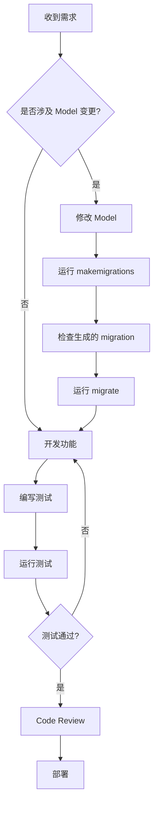

# Django Development Skills

Django/DRF 开发全流程最佳实践与陷阱规避指南。

## 何时使用此 Skill

**必须使用**：
- 开发 Django 或 DRF 项目
- 设计 REST API
- 处理数据库迁移
- 实现数据导入导出
- 排查性能问题
- 进行安全审计

**适用场景**：
- 新建 Django 项目
- 添加 API 端点
- 优化数据库查询
- 配置认证授权
- 部署到生产环境

## 工作流

### 1. 开发前检查

在开始 Django 开发前，确认：

```bash
# 检查环境
uv --version
python --version  # 推荐 3.10+

# 检查依赖
uv add django djangorestframework django-environ django-import-export
```

### 2. 核心原则（必读）

**硬性约束** (详见 [constraints.md](constraints.md))：
- ❌ 除非明确要求，不要添加缓存层
- ❌ 永远不要手写 migration 文件
- ❌ 不要手写 Django 能生成的代码
- ✅ 导入导出必须用 django-import-export
- ✅ 以最小开发单元迭代

### 3. 开发流程



### 4. 快速参考

| 场景 | 参考文档 |
|------|---------|
| 安全检查 | [security.md](security.md) |
| DRF API 设计 | [drf-api.md](drf-api.md) |
| ORM 查询优化 | [orm-optimization.md](orm-optimization.md) |
| Model 设计 | [model-design.md](model-design.md) |
| **代码生成器**(Admin/Serializer/ViewSet) | [code-generation.md](code-generation.md) ⭐ |
| Admin 高级定制 | [admin-config.md](admin-config.md) |
| 导入导出 | [import-export.md](import-export.md) |
| 测试策略 | [testing.md](testing.md) |
| 生产部署 | [deployment.md](deployment.md) |
| Code Review | [checklist.md](checklist.md) |

## 常见任务示例

### 创建新 App

```bash
# ✅ 使用 Django 命令
python manage.py startapp <app_name>

# ❌ 不要手动创建目录和文件
```

### 数据库迁移

```bash
# ✅ 正确流程
python manage.py makemigrations
python manage.py migrate

# 检查 migration 计划
python manage.py showmigrations

# ❌ 不要手写 migration 文件
```

### 创建 API 端点

```python
# 1. 定义 Serializer（读写分离）
class UserReadSerializer(serializers.ModelSerializer):
    class Meta:
        model = User
        fields = ['id', 'email', 'full_name', 'created_at']

class UserWriteSerializer(serializers.ModelSerializer):
    class Meta:
        model = User
        fields = ['email', 'password', 'first_name', 'last_name']
        extra_kwargs = {'password': {'write_only': True}}

# 2. 定义 ViewSet
class UserViewSet(viewsets.ModelViewSet):
    queryset = User.objects.all()

    def get_serializer_class(self):
        if self.action in ['create', 'update', 'partial_update']:
            return UserWriteSerializer
        return UserReadSerializer

    def get_queryset(self):
        # ✅ 在这里实现权限过滤
        return User.objects.filter(is_active=True)
```

### 数据导入导出

```python
# ✅ 使用 django-import-export
from import_export import resources
from import_export.admin import ImportExportModelAdmin

class UserResource(resources.ModelResource):
    class Meta:
        model = User
        skip_unchanged = True
        report_skipped = True

@admin.register(User)
class UserAdmin(ImportExportModelAdmin):
    resource_class = UserResource
```

## 关键检查清单

开发完成后，运行以下检查：

```bash
# 代码质量
uv run black .
uv run ruff check .
uv run mypy .

# 测试
uv run pytest --cov

# 安全检查
python manage.py check --deploy

# Migration 检查
python manage.py makemigrations --check --dry-run
```

## 延伸阅读

- [Django 官方文档](https://docs.djangoproject.com/)
- [DRF 官方文档](https://www.django-rest-framework.org/)
- [django-import-export 文档](https://django-import-export.readthedocs.io/)

---

**开始开发前，先阅读 [constraints.md](constraints.md) 了解硬性约束。**
